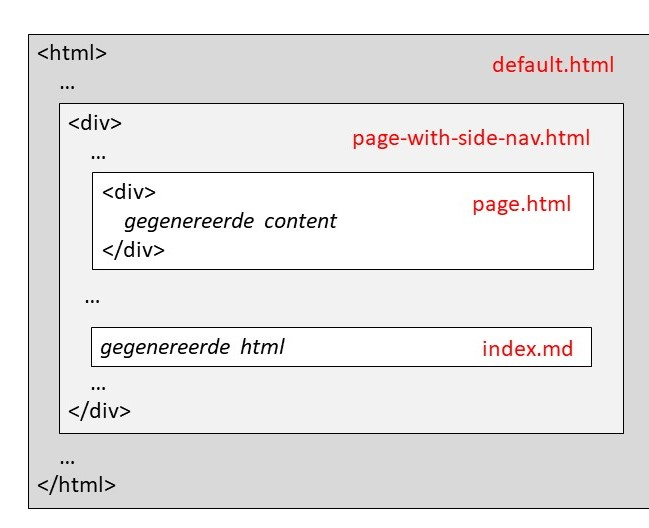

# jekyll-theme-vng-realisatie

Dit theme wordt gebruikt voor het deployen van de documentatie in VNG Realisatie repositories naar GitHub Pages.

## Generatie logica

Centraal staan daarbij de bestanden in de folders:
* _layouts
* _includes
* assets

Hieronder lichten we de folders en zo nodig de bestanden daarin toe.

### \_layouts

Deze folder bevat de layouts (of templates) voor de 4 type pagina's die we met dit theme genereren. Layouts werken volgens het volgende principe.

Minmaal 1 layout (bijv. 'default.html') bevat een basis html content met daarbinnen de jekyll code ``{{ content }}`` (een variabele). Dus zoals het volgende:
```
<html>
...
{{ content }}
...
</html>
```

Waarbij in dit voorbeeld met ``...`` andere html elementen worden bedoelt. De ``content`` variabele wordt vervangen door de (naar html omgezette) inhoud van een md bestand of de inhoud van een andere layout bestanden. Deze verwijzen in hun header dan op de volgende wijze naar de basis layout
```
---
layout: default
---
```
Andere layouts bestaan op hun beurt weer uit html tags (bijv. 'div') met evt. weer de jekyll code ``{{ content }}``. Daarvoor geldt weer hetzelfde principe als hierboven is toegelicht. Zo kan een html bestand worden opgebouwd door opeenvolgende lagen van layouts die steeds de bovenliggende laag in hun header definiëren en de content uit de md bestanden. Hieronder een voorbeeld:



De layouts kunnen overigens ook andere variabelen bevatten die in de md bestanden weer in de header of in de '\_config.yml' gedefinieerd kunnen worden.
En tenslotte kunnen de layouts ook verwijzingen bevatten naar bestanden in de '\_includes' folder. Vaak geldt dan dat dat alleen in specifieke situaties moet gebeuren. Zo wordt met de code:

```
    
      
    
```
geregeld dat als in een md bestand in de header een variabele 'head_include' is gedefinieerd het in die variabele gedefinieerde bestand uit de '\_includes' folder op de betreffende plaats moet worden opgenomen. Het kan bij bestanden in de '\_includes' folder gaan om bestanden met 'html' fragmenten, verwijzingen naar code of een css bestand.

#### default.html

Deze layout bevat de basis indeling van de VNG Realisatie pagina's. Naast de variabele ``content`` worden hierin ook de variabelen ``head_include`` en ``body_include`` gebruikt. 

Indien er voor een md  bestand in de basis GitHub Pages folder (afhankelijk van de gekozen instelling de 'docs' folder, de 'root' folder of een specifieke branch) geen layout is gedefinieerd wordt automatisch deze layout toegekend.
Duidelijker is echter het gebruik af te dwingen door in de header de vermeldde code op te nemen.

#### landing-page.html

Deze layout wordt nog niet gebruikt in een 'index.md' bestand van een van de VNG Realisatie repositories (de landingspagina). 
Er is immers nog geen portaal pagina voor de VNG Realisatie repositories.
Het bevat slechts een 'div' element dat dus aan de default layout wordt toegevoegd. Om deze layout te kunnen gebruiken wordt de code:
```
---
layout: landing-page
---
```
in het md bestand gebruikt.

#### page-with-side-nav.html

Deze layout wordt door de meeste pagina's in de VNG Realisatie site gebruikt. Naast een content deel bevat het ook een side navigatie. Ook dit bevat slechts een 'div' element waarmee het content deel van de pagina's en de side navigatie wordt gedefinieerd. Gebruik
```
---
layout: page-with-side-nav
---
```
in de header van de md bestanden om deze layout te kunnen gebruiken.

#### page.html

Layout die op dit moment niet gebruikt wordt. 

### _includes

Hier zijn building blocks opgeslagen waarmee de content van de GitHub Pages pagina's worden opgebouwd. Te weten:

* nav.html
* redoc-body.html
* side-nav.html
* swagger-ui-body.html
* swagger-ui-head.html
* topnavigatie.html

De inhoud van deze bestanden kan bestaan uit alle in html toegestane content maar kan daarnaast ook condities bevatten zoals:

```

	...

```

De bestanden 'redoc-body.html', 'swagger-ui-body.html' en 'swagger-ui-header.html' bevatten stabiele content. Hierop hoeven normaliter geen aanpassingen op uitgevoerd te worden.

Voor 'side-nav.html' en 'nav.html' geldt eigenlijk hetzelfde maar hier is enige uitleg op zijn plaats en ook de top navigatie behoeft enige uitleg.

#### De side navigatie

Het bestand 'side-nav.html' bevat een script waarmee de structuur van de side navigatie wordt opgebouwd. Dit ziet er als volgt uit:

```

	<div class="header">{{ item.title }}</div>
	<nav class="nav flex-column">
    
      
    
  
</nav>
```
De eerste regel verwijst naar het json element 'nav' in de repo's noodzakelijk bestand '\_config.yml'. Als dat dus aanwezig is worden dus i.i.g. de volgende 2 regels geplaatst. Bevat dat 'nav' element dan vervolgens ook nog een 'subnav' element dan wordt ook de include in de 5e regel uitgevoerd.
Daarmee wordt het bestand 'nav.html' opgeroepen waarbij als inhoud van de variabele 'nav' alle 'subnav' elementen wordt toegekend. Het bestand 'nav.html' heeft weer de volgende content:

```

	{{ item.path }}{{ item.path }}.html
	<a class="nav-link active" href="{{item.url}}{{ site.baseurl }}{{ item.path }}" target="_blank">{{ item.title }}</a>

```
Op alle items van de variabele 'nav' (dus eigenlijk alle 'subnav' elementen) worden de script regels 2 en 3 toegepast zodat uiteindelijk de side navigatie items worden opgebouwd. De uitleg van dit deel van het script laat ik hier achterwege. Mocht je dat willen uitpluizen dan verwijs ik je naar [deze liquid tutorial](https://shopify.github.io/liquid/). In de paragraaf ' Hoe maken repo's gebruik van dit theme' leg ik uit hoe je het ' nav' deel van het '\_config.yml' bestand vult om een nette side navigatie te verkrijgen.

#### De top navigatie

Ten opzichte van de side-navigatie is de top navigatie redelijk straight forward. Het bevat html code welke kan worden aangepast als er iets wijzigt in m.b.t. de standaarden of waaraan content kan worden toegevoegd als er nieuwe standaarden aan het lijstje met producten moet worden toegevoegd. Dit doe je in het bestand ' topnavigatie.html'.

### assets

Tenslotte bevat de folder 'assets' het noodzakelijke css bestand en alle benodigde images. Hiernaar wordt in de bestanden in de voorgaande folders verwezen.
Hierop gaan we in dit document niet verder in.

## Hoe maken repo's gebruik van dit theme

Om een repo van dit theme gebruik te laten maken moet als eerste in de GitHub Pages sectie van de Settings aangegeven worden welke branch en folder als bron voor de GitHub Pages moet worden beschouwd. Meer hoeft niet te worden aangegeven. Binnen VNG Realisatie gebruiken wij in principe altijd de 'docs' folder van de 'master/main' branch. Aan het bestand '\_config.yml' dat daarop in die folder wordt aangemaakt moet de volgende regel toegevoegd worden om de repo het onderliggende theme te laten gebruiken:

```
remote_theme: VNG-Realisatie/jekyll-theme-vng-realisatie
```

Het '\_config.yml' bestand speelt een centrale rol bij toepassen van dit theme, in het vervolg van deze uitleg komen we daar dus nog vaker op terug.

### Content

De content van de VNG Realisatie GitHub Pages site bestaat uit markdown bestanden die in de 'docs' folder of lager staan. Elke repository die aansluit bij de VNG Realisatie GitHub Pages site heeft enkele standaard markdown bestanden die overigens niet altijd voor hoeven te komen. Ik benoem ze hieronder:

| Bestand | Omschrijving |
| --- | --- |
| index.md | Bevat de hoofdpagina van de betreffende API standaard. In het algemeen is de content nagenoeg gelijk aan die van het 'README.md' bestand. |
| goals-canvas.md | Bevat een beschrijving van de epics. Er wordt beschreven wat de API wil bereiken, hoe het dat bereikt wordt, wat daarvoor de input en output is en met welk doel. Tevens zijn referenties naar de gerelateerde userstories opgenomen. |
| getting-started.md | Beschrijft welke stappen moeten worden doorlopen om aan te sluiten op de API van de betreffende basisregistratie. |
| redoc.md | Bevat gegevens om de gerelateerde API specificatie in de Redoc interface te tonen. |
| swagger-ui.md | Bevat gegevens om de gerelateerde API specificatie in de Swagger interface te tonen. |
| user-stories-prod.md | Gegenereerd bestand met een lijst van alle GitHub userstories die in de in productie versie van de standaard API zijn geïmplementeerd en de daarbij horende links naar de betreffende userstories in de gerelateerde GitHub repository. |
| user-stories-dev.md | Gegenereerd bestand met een lijst van alle GitHub userstories die aan de in ontwikkeling versie van de standaard API zijn gekoppeld en de daarbij horende links naar de betreffende userstories in de gerelateerde GitHub repository. |
| features.md | Lijst met links naar Feature bestanden in de gerelateerde GitHub repository.  |

Naast deze bestanden kunnen er natuurlijk nog andere bestanden aan de content van de site toegevoegd kunnen worden. Het opnemen van pagina's in de content structuur kan natuurlijk door er in de markdown bestanden links naartoe op te nemen je kunt ze echter ook opnemen in de side navigatie. Hoe dat werkt en hoe bovenstaande documenten daarin zijn opgenomen lees je in de volgende paragraaf.

### Configuratie side navigatie

De configuratie van de side navigatie gebeurd in het '\_config.yml' bestand in de 'nav' property. 
Die property kan bestaan uit 1 of meer secties.
Elke sectie bestaat uit een 'title' en een 'subnav' property. Elke 'subnav' property bevat vervolgens weer 1 of meer subsecties.
Tenslotte bestaat elke subsectie weer uit een 'title' gevolgd door een 'url' of 'path' property gevolgd door een optionele 'target' property. Op deze wijze kun je de volgende structuur creëren:

```
nav:
  - title: BRP Bevragen
    subnav:
      - title: Main
        path: /
      - title: Goals canvas
        path: /goals-canvas
  - title: Specificaties v. 1.0 (Live)
    subnav:
      - title: Getting started
        path: /getting-started
      - title: User stories
        path: /user-stories-prod
      - title: User stories (afgeschermd)
        url: https://gitlab.com/vng-realisatie/haal-centraal-brp-afgeschermd/-/issues?label_name%5B%5D=BRP+bevragen
	target: blank
  - title: Specificaties v. 1.1 (IO)
    subnav:
      - title: User stories
        path: /user-stories-dev
```

Met de 'title' properties regel je wat men uiteindelijk in de side naviatie te zien krijgt. De titles in de secties dienen slechts ter ordening maar van de titles in de subsecties kunnen links gemaakt worden. Dat kan door daar een 'path' of een 'url' property aan toe te voegen. Met de 'target' property kan vervolgens het gedrag van de link worden aangepast.

Een 'path' property bevat altijd de naam van een bestand in de 'docs' folder van de repository. Is het een markdown bestand dan wordt daarvan de extensie '.md' weggelaten. Staat het bestand in een subfolder van de 'docs' folder dan dient dat path ook aan de bestandsnaam toegevoegd te worden.
De 'url' property wordt gebruikt om een link te genereren naar een externe bron. In het bovenstaande voorbeeld is dat bijvoorbeeld gebruikt om te linken naar een lijst met userstories die in een GitLab repository staan.

De 'target' property kan tenslotte gebruikt worden om er voor te zorgen dat het klikken op een link leidt tot het openen van een nieuw browser tabblad waarin de bron geöpende wordt. De waarde van de 'target' property moet dan 'blank' zijn.

### Bestanden met een gebruiksaanwijzing

Enkele van de standaard bestanden hebben een gebruiksaanwijzing. Het gaat daarbij met name om de bestanden 'redoc.md' en 'swagger-ui.md'. Beide bestanden hebben slechts een minimale content maar wel enkele variabele in de header die de andere bestanden niet hebben.

**Let op!** Een deel van de content van deze bestanden is alleen zichtbaar in 'raw' en 'edit' mode.

#### redoc.md

De content van dit bestand bestaat uit niet meer dan:

```
<redoc spec-url='{{ page.spec-url}}'></redoc>
```

'page.spec-url' verwijst naar de variabele 'spec-url' die in de header van dit bestand is gedefinieerd. Het bevat de link naar de raw genereervariant van de openapi.yaml (de openapi specificatie). 
Na resolving wordt de 'content' van deze pagina gevormd door 

```
<redoc spec-url='https://raw.githubusercontent.com/VNG-Realisatie/Web-Security/master/specificatie/genereervariant/openapi.yaml'></redoc>
```

dit wordt dus via de in dit bestand gedefinieerde layout (page-with-side-nav) ingelezen in de default layout. 
De default layout bevat tevens de code

```
   
      
    
```

Code die dus alleen actief wordt als de variabele 'body_include' gedefinieerd is wat van toepassing is op het bestand 'redoc.md'. Daar is deze variabele te vinden in de header met de waarde 'redoc-body.html'. Daarmee wordt de content van het bestand 'redoc-body.html', wat te vinden is in de onderliggende repository, in de '\_includes' folder, op de betreffende plaats ge-include in de default layout.

#### swagger-ui.md

De verwerking van dit bestand werkt ongeveer hetzelfde als het voorgaande. De content bestaat uit niet meer dan

```
<div id="swagger-ui"></div>
```

Ditmaal 3 variabelen die in de header zijn gedefinieerd 'head_include', 'body_include' en 'openapi-url'. De verwerking van de variabele 'body_include' werkt nu weer hetzelfde als bij het redoc.md bestand alleen wordt nu naar een gehel ander bestand verwezen, te weten 'swagger-ui-body.html'. Dit kan wederom gevonden worden in de '\_include' folder. In 'swagger-ui-body.html' wordt gebruik gemaakt van de variabele 'openapi-url' die bestaat uit de link naar de raw genereervariant van de openapi.yaml (de openapi specificatie).
De default layout bevat tenslotte nog de code

```
    
      
    
```

Nu dus code die alleen actief wordt als de variabele 'head_include' gedefinieerd is wat van toepassing is op het bestand 'swagger-ui.md'. Daarmee wordt de content van het bestand 'swagger-ui-head.html', wat te vinden is in de onderliggende repository in de '\_includes' folder, op de betreffende plaats ge-include in de default layout.

## Geautomatiseerde handelingen

### Rebuild

Zodra er in een repository, die dit theme gebruikt, een wijziging wordt aangebracht in een bestand in de basis GitHub Pages folder wordt er automatisch een rebuild uitgevoerd van de deployment waardoor de wijzigingen redelijk snel zichtbaar worden in de GitHub Pages site behorende bij die repository. Echter als er een wijziging wordt aangebracht in dit theme (de jekyll-theme-haal-centraal repository) dan wordt die wijziging pas zichtbaar in de GitHub pages van een repository als er in die repsitory een wijziging wordt aangebracht in een bestand in de basis GitHub Pages folder. 

Dat laatste is meestal ongewenst. Vaak willen we nl. dat die wijziging direct wordt doorgevoerd op de GitHub pages van alle repositories die dit theme gebruiken.
Het zou dan erg omslachtig en ongewenst zijn om in elke repository dan een hele kleine wijziging door te voeren om daarmee de rebuild te triggeren.
Daarom is binnen de onderliggende repository een action (script) gedefinieerd waarmee we een rebuild op al deze repositories afdwingen. Het script kun je in de onderliggende repository vinden in '.github/workflows/gh-pages-rebuild.yml' en kan afgetrapt worden in de 'Actions' tab van deze repository.
Dit script maakt gebruik van een organization secret (token) waarmee dit script toegang wordt verleend tot de respositories waarop een rebuild moet worden uitgevoerd.

**Let op!** Zodra een nieuwe repository dit theme gebruikt moet het worden toegevoegd aan dit script.

<!-- Onderstaande is volgens mij op onderliggende repository niet van toepassing.

### Generate-user-stories

De pagina van een VNG Realisatie API standaard kan maximaal 2 versies van de standaard bevatten, de versie die in produktie is en de versie die in ontwikkeling is.
Natuurlijk kunnen deze bestanden handmatig vervaardigd worden maar dat kost ten eerste erg veel tijd en is ten tweede erg foutgevoelig. Om die reden wordt in elke repository die het onderliggende theme gebruikt het script 'generate-user-stories' geplaatst (in de folder '.github/workflows/'). Het script genereert zo gewenst (afhankelijk van welke versie getoond moet worden) een lijst met userstories die geïmplementeerd zijn in de produktie versie en een lijst met userstories die gepland staan voor implementatie in de in ontwikkeling versie.
Aangezien elke repository een andere status kan hebben en dus een andere produktie en in ontwikkeling versie moet het script aangepast worden aan de status van de repository.
Ook gedurende de tijd moet dit script onderhouden worden. Als in een repository de produktie versie 1.2.0 versie 1.1.0 gaat vervangen en versie 1.3.0 in ontwikkeling gaat heeft dat dus gevolgen voor het script. Het voert te ver om hier over de werking van het script uit te wijden dus daarvoor verwijs ik naar [de uitleg van het script in de API Kennisbank](https://github.com/VNG-Realisatie/API-Kennisbank/blob/master/GitHub%20Actions/haal-centraal.md).-->
